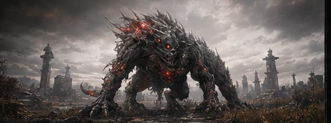

# 황혼 (TWILIGHT) — GAME UI

제공된 UI 컨셉 시트 / 설계 보드 9장을 실제로 동작하는 화면으로 구현한 정적 프론트엔드입니다.
빌드 도구·프레임워크·번들러 없이 **브라우저에서 파일을 바로 열면** 동작합니다.

```
game-ui/
├── index.html        컨셉 시트 + 화면 보드(각 화면 실시간 미리보기)
├── office.html       1. 인력사무실 (로비)
├── quest.html        2. 의뢰 상세 / 보스 도감
├── party.html        3. 파티 모집 / 인력사무실
├── battle.html       4. 전투 화면 (HUD)
├── inventory.html    5. 장비 / 인벤토리
├── forge.html        6. 장비 관리 / 강화 (재료·확률·비용은 items.js)
├── craft.html        6-1. 장비 관리 / 제작 (레시피 · 재료 보유/필요 · 제작)
├── profile.html      7. 플레이어 프로필 / 기술 등급
├── result.html       8. 전투 결과 / 보상 정산
├── benchmark.html    9. UI 벤치마크 / 제안 압축 시트
├── characters.html   캐릭터 설정 시트 (턴어라운드 뷰어)
├── compare.html      디자인 시트 ↔ 구현 대조 뷰어
├── design-sheets/    원본 설계 시트 9장 + characters/ 캐릭터 시트 4장
├── art/              시트에서 추출한 일러스트 에셋
├── css/tokens.css    디자인 토큰 (팔레트·타이포·등급 컬러·간격)
├── css/ui.css        공용 컴포넌트 (패널·배지·슬롯·게이지·버튼·탭 …)
└── js/icons.js       SVG 아이콘 스프라이트 (60여 종, currentColor 상속)
    js/ui.js          런타임 (탭·선택·게이지·슬롯·카운트다운·화면 전환·스테이지 피팅)
    js/items.js       장비 · 재료 · 소모품 · 레시피 · 강화 단계표 (단일 원본)
    js/inventory.js   인벤토리 화면 렌더러 (장착/해제 · 비교 · 필터)
```

## 실행

```bash
# 아무 정적 서버나 사용 (또는 index.html을 브라우저로 바로 열기)
npx http-server game-ui -p 8080
```

`index.html`이 시작점입니다. 모든 화면 하단에 **화면 전환 독**이 떠 있고, `H` 키로 숨길 수 있습니다.

## 아이템 데이터 (`js/items.js`)

장비·재료·소모품·제작 레시피·강화 단계표가 이 파일 하나에 들어 있고,
인벤토리 · 강화 · 제작 화면이 여기서 읽어 렌더링합니다.

| 구분 | 내용 | 출처 |
|---|---|---|
| `EQUIP` | 무기 7 · 방어구 5 · 악세서리 3 (전투력·기본/추가 공격·치명·효과·내구·판매가·귀속) | 시트 항목 + `src:'fill'` 가안 |
| `MATERIAL` | 강화 합금 124 · 응축된 파편 78 · 정제된 에너지 코어 24 · 고급 강화 보조제 9 + 채집 재료 6종 | 06-forge / 05-inventory |
| `CONSUMABLE` | 회복약 · 투척 폭약 · 채집 도구 · 지혈제 · 임무 아이템 2종 | 시트 + 가안 |
| `RECIPE` | 9종 — 메마른 갈대밭 검창 레시피는 강화 재료 필요량(36/18/6)과 동일 수치 | 시트 + 가안 |
| `ENHANCE` | +1 ~ +10 성공률·비용·재료. +5 = 65% / 18,000 G, +7 옵션 잠금 해제 | 06-forge |
| `PLAYER` | 골드 75,300 · 제작 숙련 20 · 장착 슬롯 · 가방 | 시트 |

각 항목의 `src` 가 `'sheet'` 면 디자인 시트에서 확인되는 수치, `'fill'` 이면
시트에 이름이 없어 세계관에 맞춰 채운 가안입니다. **실제 기획 자료가 오면 이 파일만 교체**하면
세 화면이 그대로 따라옵니다. 새 항목에 필요한 키: `id · name · type · slot · rarity · icon · cp · stats`.

## 디자인 토큰

컨셉 시트의 MAIN COLOR PALETTE를 그대로 `css/tokens.css`에 옮겼습니다.

| 토큰 | 값 | 용도 |
|---|---|---|
| `--c-void` | `#0B0C0F` | 최심부 배경 |
| `--c-panel` | `#1A1B1F` | 패널 기본면 |
| `--c-steel` | `#2B3C31` | 스틸/보조면 |
| `--c-gray` | `#8A8A8A` | 보조 텍스트 |
| `--c-red` | `#A51C1C` | 주요 액션 |

타이포는 **Noto Serif KR**(제목) / **Noto Sans KR**(본문)이며 Google Fonts에서 로드합니다.
오프라인 환경에서는 `--f-serif` / `--f-sans` 폴백 스택이 적용됩니다.

등급 컬러(S/A/B/C)와 아이템 레어도(일반·희귀·영웅·전설·신화)는 벤치마크 시트의
"컬러 시스템(권장)" 원칙에 맞춰 토큰화되어 있습니다.

## 디자인 시트 (작업 기준 원본)

`design-sheets/` 에 원본 설계 시트 9장이 들어 있습니다. 모든 화면은 이 시트를 기준으로
작업하며, 시트와 구현은 **같은 1672px 좌표계**를 씁니다.

| 파일 | 대응 화면 |
|---|---|
| `00-concept.webp` | 컨셉 시트 (팔레트·타이포·레퍼런스) |
| `01-office.webp` | 인력사무실 |
| `02-quest.webp` | 의뢰 상세 / 보스 도감 |
| `03-party.webp` | 파티 모집 |
| `05-inventory.webp` | 장비 / 인벤토리 |
| `06-forge.webp` | 장비 관리 / 강화 |
| `07-profile.webp` | 플레이어 프로필 |
| `08-result.webp` | 전투 결과 / 보상 정산 |
| `09-benchmark.webp` | UI 벤치마크 압축 시트 |
| `characters/ain·kain·ryu·sera.webp` | 캐릭터 턴어라운드 (정면/측면/후면) |

`compare.html` 에서 시트와 구현을 겹쳐 놓고 분할 슬라이더로 대조할 수 있습니다.
화면을 수정한 뒤에는 이 뷰어로 시트와 어긋난 곳을 확인하고 작업하십시오.

> 시트 원본은 941px, 구현 스테이지는 952px이라 하단에서 약 11px 차이가 납니다.
> 대조 시 이 오차를 감안하십시오.

## 아트 에셋

일러스트는 원본 시트에서 잘라내 `art/` 에 WebP로 관리합니다 (총 약 0.4MB).
모든 아트 자리는 `.art` 컨테이너로 분리되어 있어 교체는 이미지 한 장이면 됩니다.

```html
<div class="art art--beast">
  
</div>
```

| 에셋 | 쓰이는 곳 |
|---|---|
| `office-brief` | 인력사무실 중앙 브리핑 |
| `boss-marsh` / `boss-anatomy` | 보스 아트 · 부위 파괴 다이어그램 |
| `portrait-ain/kain/ryu/sera` | 파티 모집 카드 (상황 일러스트) |
| `face-ain/kain/ryu/sera` | 모든 소형 아바타 슬롯 (캐릭터 시트 얼굴, 알파) |
| `full-* / side-* / back-*` | 캐릭터 설정 시트 턴어라운드 · 인벤토리 페이퍼돌 (알파) |
| `char-inventory` / `char-profile` / `char-result` | 전신 캐릭터 아트 |
| `forge-kain` | 대장간 |
| `lobby-city` / `story-city` | 폐허 도시 · 전장 배경 |

캐릭터 시트는 회색 배경을 알파로 제거해 추출했습니다 — 배경은 이미지 가장자리와 이어진
무채색 영역으로 잡고(가장자리 플러드필 + 채도 판정), 피부처럼 배경 밝기에 가까운 색은
윤곽 안쪽이면 전경으로 유지합니다. 새 캐릭터 시트가 오면 같은 절차로 뽑으면 됩니다.

보정 클래스: `.art--top`(상단 기준, 얼굴 노출) `.art--mid`(상단 32%) `.art--avatar`(알파 얼굴) `.art--doll`(전신 contain)
분위기 폴백: `.art--beast` `.art--portrait` `.art--city` `.art--forge` `.art--office`
— 이미지를 비우면 절차적 플레이스홀더로 되돌아갑니다.

새 크롭이 필요하면 원본 시트에서 좌표를 지정해 추출하십시오.

## 해상도

설계 기준 해상도는 **1672 × 952 (16:9)** 입니다.
`js/ui.js`가 뷰포트가 좁을 때 스테이지 전체를 비율 유지하며 축소하므로
노트북/태블릿에서도 레이아웃이 깨지지 않습니다.

## 상호작용

마크업만으로 동작하는 데이터 속성을 씁니다. 별도 초기화 코드가 필요 없습니다.

| 속성 | 동작 |
|---|---|
| `data-tabs` / `data-tab` | 탭 전환 (`data-pane`과 연결 가능) |
| `data-pick` | 컨테이너 내 단일 선택 (리스트·카드·슬롯) |
| `data-fill="62"` | 진행 바 채움 (%) |
| `data-seg="72"` | 12칸 분절 게이지 (구조 안정성 등) |
| `data-gauge="87"` | 원형 숙련도 게이지 |
| `data-slots="15"` | 아이템 슬롯 그리드 자동 생성 |
| `data-countdown="55"` | 초 단위 카운트다운 |
